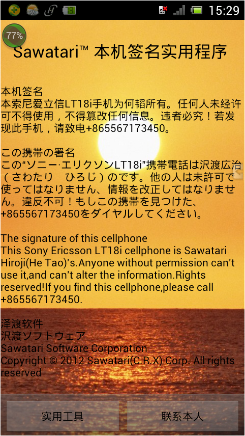
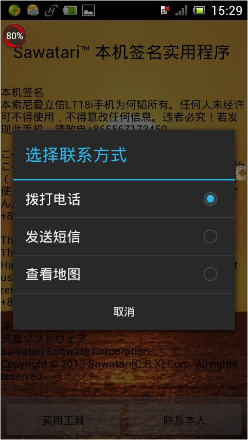
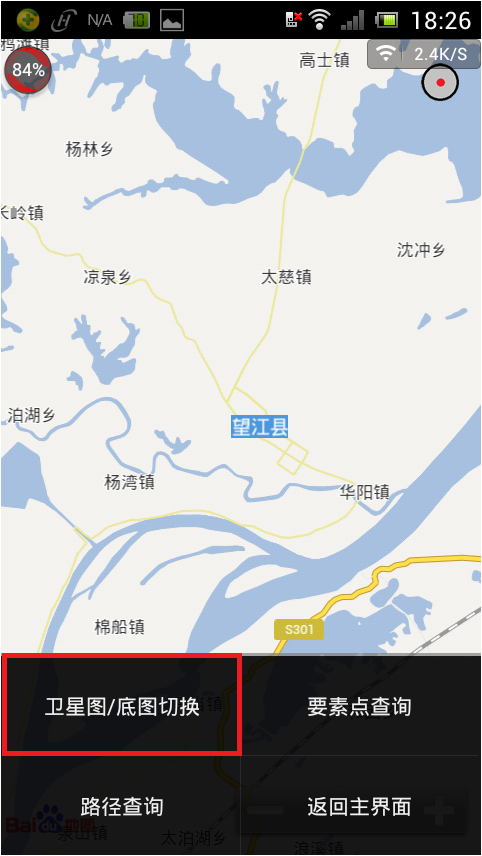
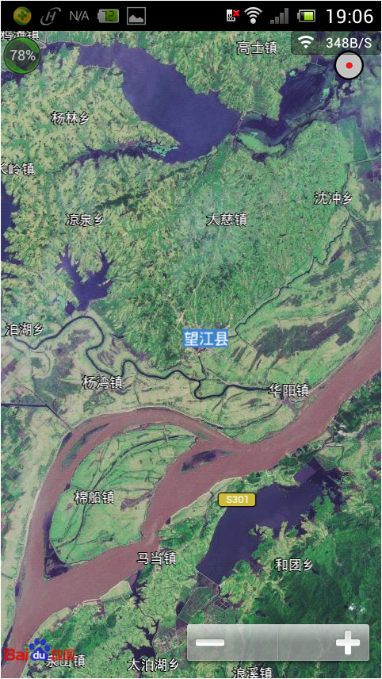
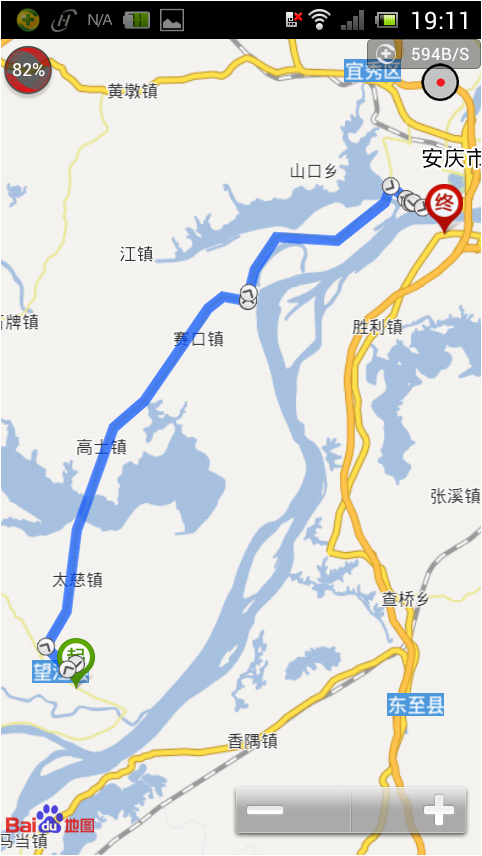
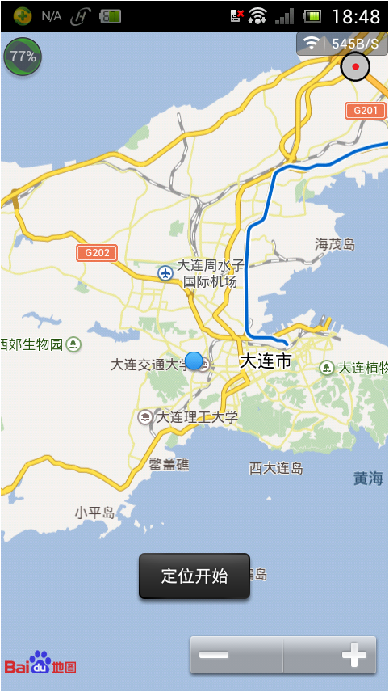
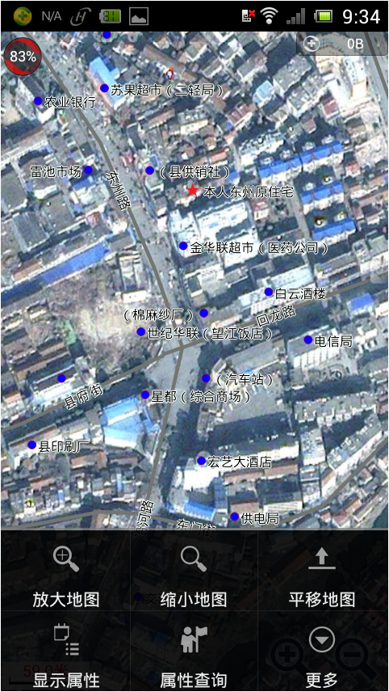
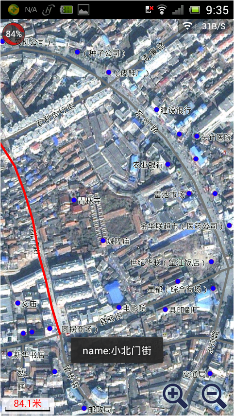
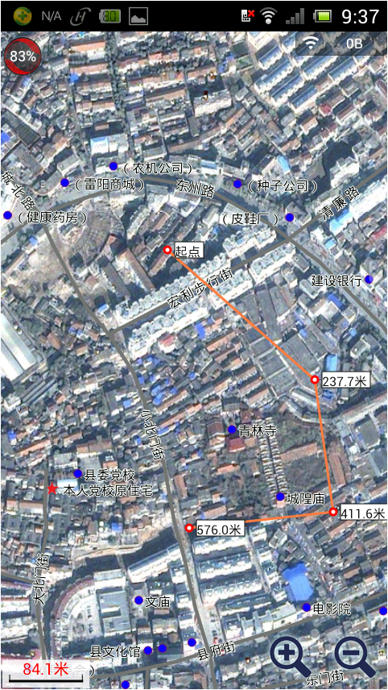
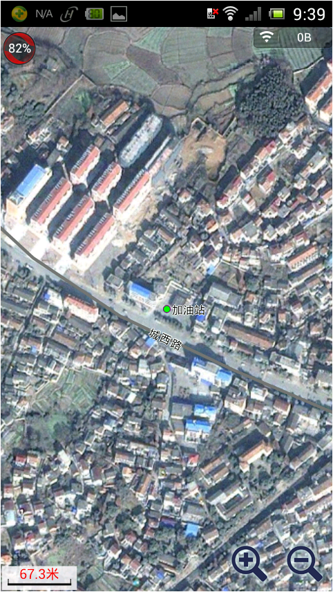

SawatariID
==========

This is my first Android application when I decided to learn Java in 2012. 

This APP has these functions:
(1) Contact me, including call me and send me a SMS; 

(2) Show online map, route query, and get the location of user.(Base on Baidu map SDK)
   

   

(3) Show offline map, inquire the information of streets, POI and bus lines. (Base on UCMap SDK)

   

   
   
(4) Get latitude and longitude, recorder, compass, flashlight, calculator and so on.

